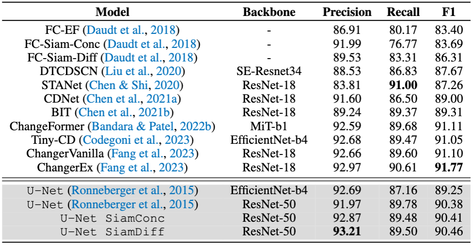
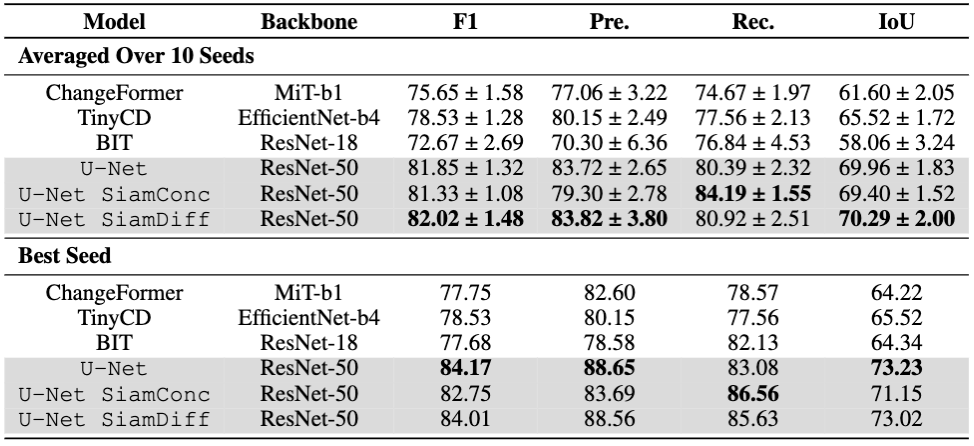

# A Change Detection Reality Check

Code and experiments for the paper, ["A Change Detection Reality Check"](https://arxiv.org/abs/2402.06994).

### Summary

Remote sensing image literature from the past several years has exploded with proposed deep learning architectures that claim to be the latest state-of-the-art on standard change detection benchmark datasets. However, has the field truly made significant progress? In this paper we perform experiments which conclude a simple U-Net segmentation baseline without training tricks or complicated architectural changes is still a top performer for the task of change detection.

### Results

We find that U-Net is still a top performer on the LEVIR-CD and WHU-CD benchmark datasets. See below tables for comparisons with SOTA methods.

<p align="center">
    <br/>
    <b>Table 1.</b> Comparison of state-of-the-art and change detection architectures to a U-Net baseline on the LEVIR-CD dataset. We report the test set precision, recall, and F1 metrics of the positive change class. For the baseline experiments we perform 10 runs while varying random the seed and report metrics from the highest performing run. All other metrics are taken from their respective papers. The top performing methods are highlighted in bold. Gray rows indicate our baseline U-Net and siamese encoder variants.
</p>

<p align="center">
    <br/>
    <b>Table 2.</b> Experimental results on the WHU-CD dataset. We retrain several state-of-the-art methods using the original dataset’s train/test splits instead of the commonly used randomly split preprocessed version created in (Bandara & Patel (2022a)). We find that these state-of-the-art methods are outperformed by a U-Net baseline. We report the test set precision, recall, F1, and IoU metrics of the positive change class. For each run we select the model checkpoint with the lowest validation set loss. We provide metrics averaged over 10 runs with varying random seed as well as the best seed. Gray rows indicate our baseline U-Net and siamese encoder variants.
</p>

### Reproducing Results

Download the [LEVIR-CD](https://chenhao.in/LEVIR/) and [WHU-CD](http://gpcv.whu.edu.cn/data/building_dataset.html) datasets and then use the following notebooks to chip the datasets into non-overlapping 256x256 patches.

```bash
scripts/preprocess_levircd.ipynb
scripts/preprocess_whucd.ipynb
```

To train UNet on both datasets over 10 random seeds run

```bash
python train_levircd.py --train-root /path/to/preprocessed-dataset/ --model unet --backbone resnet50 --num_seeds 10
python train_whucd.py --train-root /path/to/preprocessed-dataset/ --model unet --backbone resnet50 --num_seeds 10
```

To evaluate a set of checkpoints and save results to a .csv file run:

```bash
python test_levircd.py --root /path/to/preprocessed-dataset/ --ckpt-root lightning_logs/ --output-filename metrics.csv
python test_whucd.py --root /path/to/preprocessed-dataset/ --ckpt-root lightning_logs/ --output-filename metrics.csv
```

### Model Checkpoints

Coming soon. Will be uploaded to HuggingFace

### Citation

If this work inspired your change detection research, please consider citing our paper:

TBD
